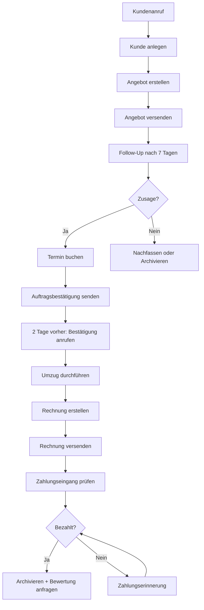

# 🔄 Prozess-Workflows - Relocato

## 📋 Komplett-Workflow: Vom Anruf bis zur Rechnung



---

## 1️⃣ Phase: ANGERUFEN

### Was tun:
✅ Kundendaten erfassen
✅ Umzugsdetails notieren
✅ Angebot berechnen
✅ Phase auf "angerufen" setzen

### CRM-Aktionen:
```typescript
// Kunde anlegen
create_customer({
  name, phone, email, fromAddress, toAddress, moveDate
});

// Phase setzen
move_customer_phase(customerId, 'angerufen');

// Notizen
addNote("Anruf am [DATUM]: [DETAILS]");
```

### Timeframe:
- Angebot versenden: **Innerhalb 24h**

---

## 2️⃣ Phase: NACHFASSEN

### Wann:
- 7 Tage nach Angebot ohne Rückmeldung

### Was tun:
✅ Follow-Up-Email senden
✅ Optional: Anrufen
✅ Verfügbarkeit prüfen
✅ Bei Interesse → Besichtigung anbieten

### Email-Template:
"Ihr Umzugsangebot - Haben Sie noch Fragen?"

### Timeframe:
- Nach 14 Tagen ohne Reaktion → Nochmal nachfassen
- Nach 21 Tagen ohne Reaktion → Archivieren

---

## 3️⃣ Phase: ANGEBOT_ERSTELLT

### Wann:
- Angebot wurde versendet
- Kunde hat Interesse signalisiert

### Was tun:
✅ Auf Rückfragen reagieren
✅ Ggf. Besichtigung vereinbaren
✅ Angebot anpassen bei Bedarf
✅ Auf Vertragsabschluss hinarbeiten

### Wichtig:
- Angebot ist **4 Wochen gültig**
- Bei Preisänderungen: Neues Angebot
- Follow-Up bei 7 Tagen vor Ablauf

---

## 4️⃣ Phase: BESICHTIGUNG_GEPLANT

### Wann:
- Besichtigungstermin vereinbart

### Was tun:
✅ Termin im Kalender eintragen
✅ 1 Tag vorher: Erinnerung an Kunde
✅ Besichtigung durchführen
✅ Angebot ggf. anpassen
✅ Nach Besichtigung: Finales Angebot

### Bei Besichtigung:
- Volumen neu schätzen
- Zugangswege prüfen
- Besonderheiten notieren
- Parkplatz-Situation klären
- Kunde beraten

---

## 5️⃣ Phase: DURCHFÜHRUNG

### Wann:
- Auftrag ist beauftragt
- Umzug läuft oder steht an

### Vorbereitung (1 Woche vorher):
✅ Team einteilen
✅ Fahrzeug reservieren
✅ Material bereitstellen
✅ Route planen

### 2 Tage vorher:
✅ Kunde anrufen (Bestätigung)
✅ Checkliste durchgehen
✅ Team briefen

### Am Umzugstag:
✅ Pünktlich sein
✅ Zustandsprotokoll (Fotos)
✅ Kunde zufrieden?
✅ Nachberechnung klären
✅ Rechnung vorbereiten

### Nach Umzug:
✅ Phase → "Rechnung"
✅ Rechnung erstellen & versenden

---

## 6️⃣ Phase: RECHNUNG

### Wann:
- Umzug abgeschlossen

### Was tun:
✅ Rechnung erstellen (sofort)
✅ Rechnung per E-Mail + Post
✅ Zahlungsziel: 14 Tage
✅ Follow-Up bei Überschreitung

### Zahlungseingang:
- **Sofort:** Phase → "Bewertung"
- **+5 Tage:** Erinnerung
- **+14 Tage:** Mahnung Stufe 1
- **+21 Tage:** Mahnung Stufe 2
- **+30 Tage:** Mahnung Stufe 3 / Inkasso

---

## 7️⃣ Phase: BEWERTUNG

### Wann:
- Rechnung bezahlt
- 5-7 Tage nach Umzug

### Was tun:
✅ Bewertungs-Email senden
✅ Bei positiver Erfahrung: Um Google-Bewertung bitten
✅ Bei negativer Erfahrung: Feedback einholen & verbessern

### Incentive:
"Verlosen jeden Monat 50€ Gutschein unter Bewertern!"

---

## 8️⃣ Phase: ARCHIVIERT

### Wann:
- Alles erledigt
- Rechnung bezahlt
- Bewertung erhalten (optional)

### Was tun:
✅ Kundendaten archivieren
✅ Für Re-Marketing vormerken
✅ Bei Umzug in 1-2 Jahren: Nachfassen

### Follow-Up (1 Jahr später):
"Alles gut im neuen Zuhause? Falls Sie nochmal umziehen
oder jemanden kennen - wir sind für Sie da!"

---

## 🎯 Spezial-Workflows

### Workflow: Besichtigung vor Ort

**Vorbereitung:**
- Adresse & Kontakt
- Termin bestätigt
- Equipment: Tablet, Maßband, Kamera

**Vor Ort:**
1. Begrüßung & Vorstellung
2. Räume begehen
3. Volumen schätzen (genau!)
4. Zugangswege prüfen
5. Besonderheiten fotografieren
6. Kunde beraten
7. Preis nennen (Range)

**Nachbereitung:**
- Notizen ins CRM
- Fotos hochladen
- Angebot anpassen
- Angebot versenden (gleicher Tag!)

---

### Workflow: Nachberechnung

**Wann:** Tatsächlicher Aufwand > Angebot

**Prozess:**
1. Erfassen: Mehrstunden, Zusatzleistungen
2. Dokumentieren: Fotos, Notizen
3. Berechnen: Stundensatz × Mehrzeit
4. Kunde informieren (VOR Rechnung!)
5. Nachberechnung erstellen
6. Mit Begründung versenden

**Transparenz:** Immer erklären WARUM Mehrkosten!

---

### Workflow: Reklamation

**Sofort:**
1. Schadensmeldung aufnehmen
2. Fotos anfordern
3. Versicherung informieren
4. Kunde update geben (24h)

**Dann:**
5. Schaden bewerten
6. Angebot Kulanz/Erstattung
7. Vereinbarung schriftlich
8. Abwicklung
9. Follow-Up (Kunde zufrieden?)

**Ziel:** Aus unzufriedenem Kunden zufriedenen machen!

---

## 📊 Reporting-Workflows

### Täglicher Report (Morgen, 9 Uhr)
```
KI generiert:
- Heutige Umzüge (Liste mit Details)
- Offene Follow-Ups (priorisiert)
- Überfällige Rechnungen
- Neue Anfragen (ungeles en)
- Termine diese Woche
```

### Wöchentlicher Report (Montag)
```
- Umzüge letzte Woche (Anzahl, Umsatz)
- Neue Kunden (Anzahl)
- Conversion-Rate (Angebote → Aufträge)
- Pipeline-Status (pro Phase)
- Top-Baustellen
```

### Monatlicher Report
```
- Gesamtumsatz
- Anzahl Umzüge
- Durchschnitts-Auftrags-Wert
- Kunden-Zufriedenheit (Bewertungen)
- Vergleich zu Vormonat
- Prognose nächster Monat
```

---

## 💡 Best Practices

### Für Bürokräfte:

**Morgen-Routine:**
1. CRM öffnen
2. Tagesübersicht checken (KI nutzen!)
3. Überfällige Follow-Ups
4. E-Mails bearbeiten
5. Termine vorbereiten

**Abend-Routine:**
1. Alle Notizen ins CRM
2. Follow-Ups für morgen vorbereiten
3. Offene Anfragen abschließen

**Goldene Regeln:**
✅ ALLES ins CRM dokumentieren
✅ Follow-Ups NIEMALS vergessen
✅ Kunden-Erwartungen managen
✅ Bei Unsicherheit: Rücksprache!

---

**Die KI kann bei ALLEN diesen Workflows helfen!**